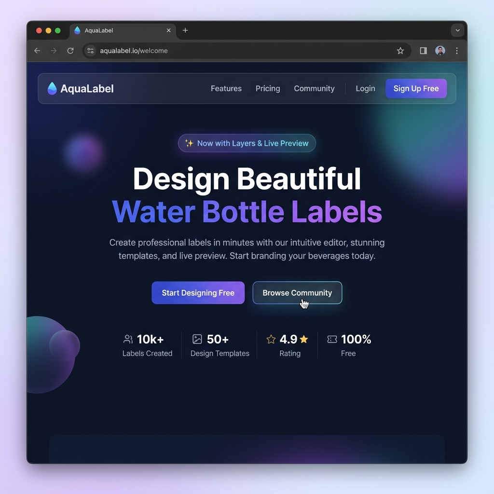
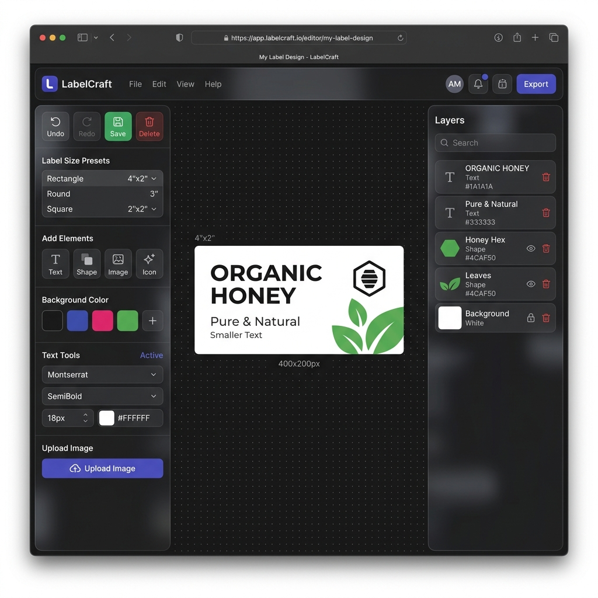
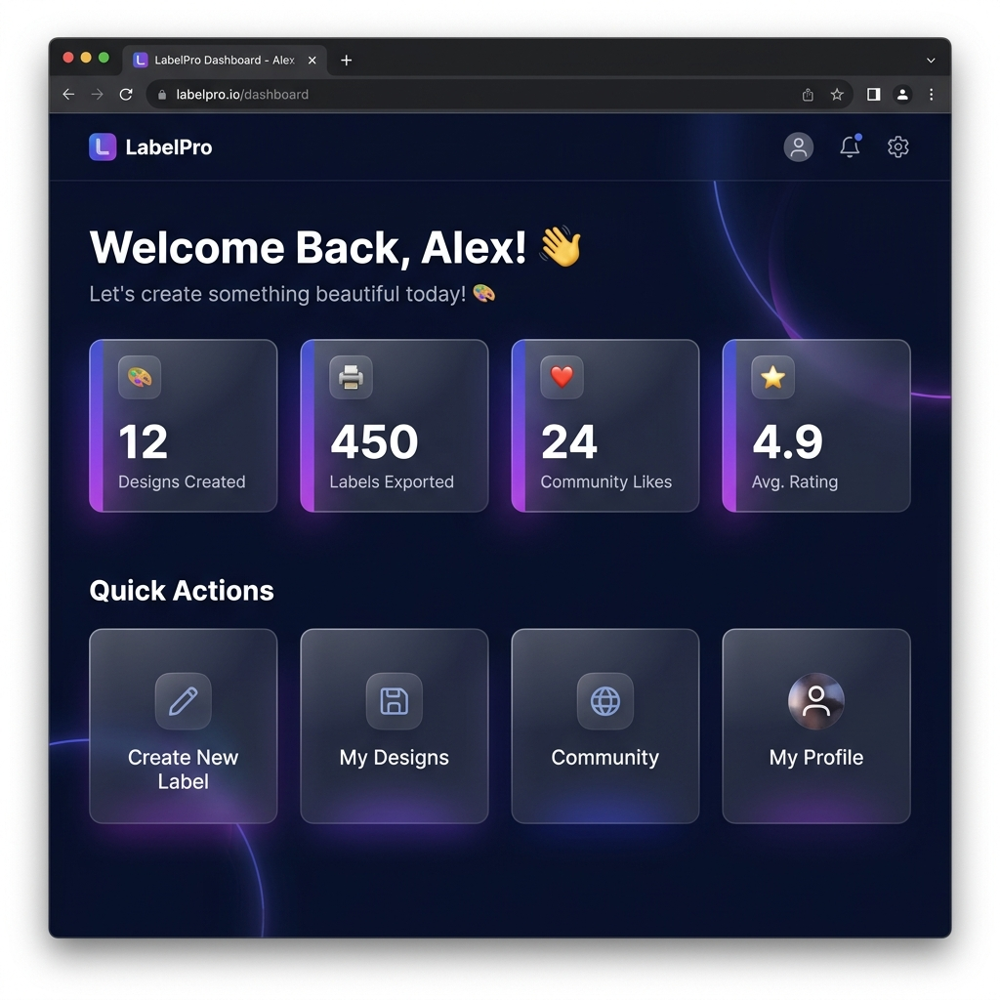
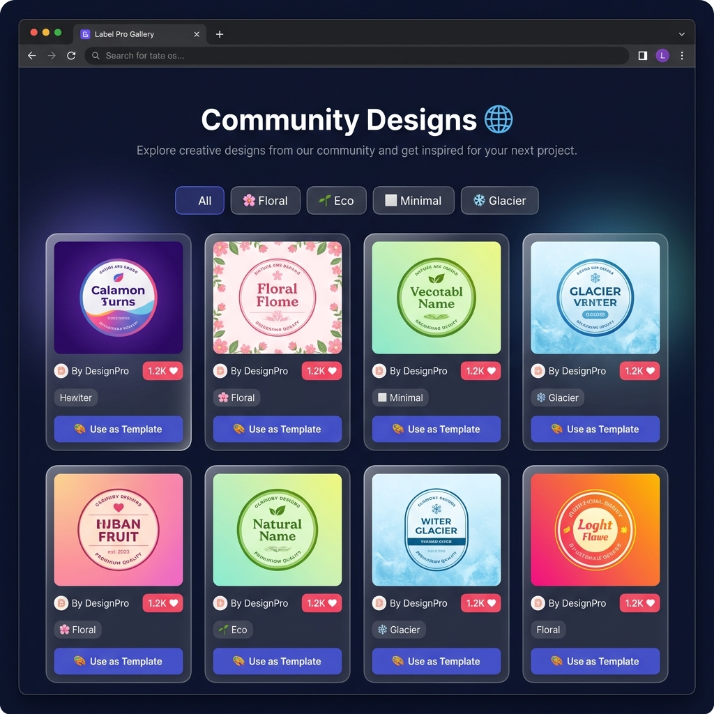
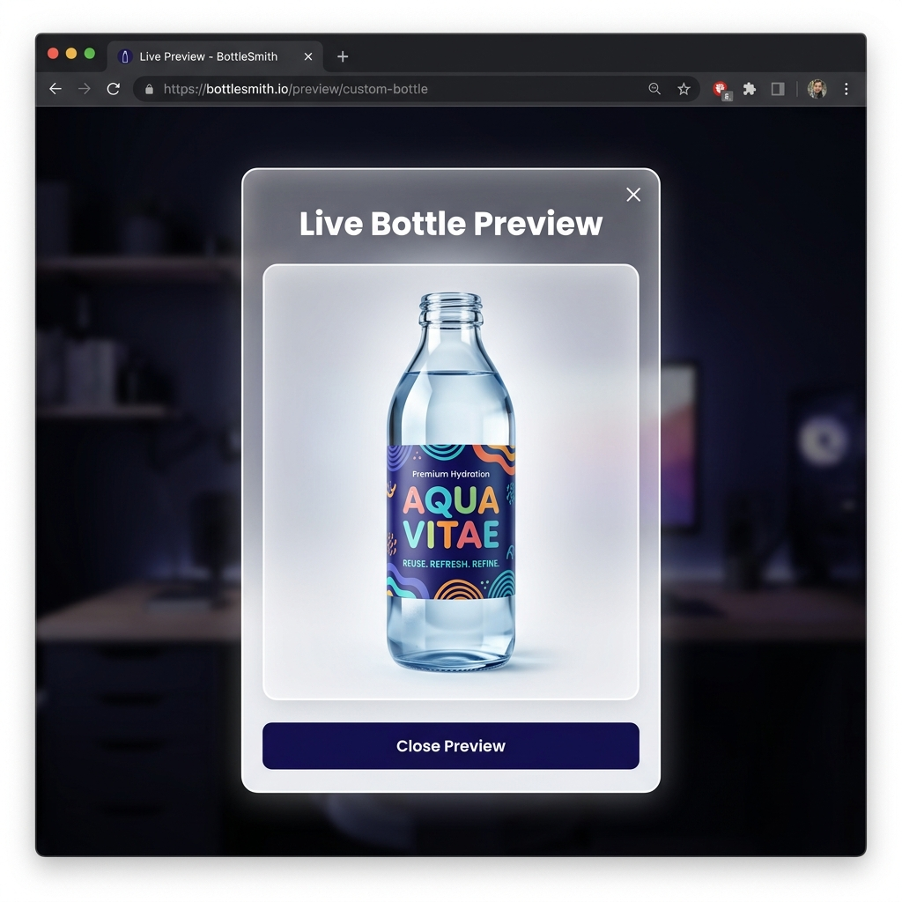

<div align="center">

<br/>


<h1>AquaLabel — Custom Water Bottle Label Designer</h1>

<p>
  A premium, 100% browser-based drag-and-drop label design platform.<br/>
  Create, customize, preview, and export stunning water bottle labels — instantly.
</p>

<br/>

[](LICENSE)
[](https://developer.mozilla.org/en-US/docs/Web/HTML)
[](https://developer.mozilla.org/en-US/docs/Web/CSS)
[](https://developer.mozilla.org/en-US/docs/Web/JavaScript)
[](#)
[](CONTRIBUTING.md)

<br/>

[🚀 Live Demo](#getting-started) · [📖 Docs](#project-structure) · [🤝 Contributing](CONTRIBUTING.md) · [🐛 Report Bug](../../issues)

<br/>

</div>

---

## 📸 Screenshots

<div align="center">

### 🏠 Landing Page


<br/><br/>

### ✏️ Label Editor — with Layers Panel


<br/><br/>

### 📊 Dashboard


<br/><br/>

### 🌐 Community Gallery


<br/><br/>

### 🔍 Live 3D Bottle Preview


</div>

---

## ✨ Features

<table>
<tr>
<td width="50%">

**🎨 Design Tools**
- Drag-and-drop canvas editor
- Resize handles for all elements
- Rectangle & circle shape drawing
- Rich text with multiple fonts & sizes
- Custom color picker for every element
- Logo & image upload (or drag from desktop)

</td>
<td width="50%">

**🗂️ Layer Management**
- Live layers panel (right sidebar)
- Click any layer to select & edit
- Delete elements directly from the panel
- Move layers front/back
- Element auto-naming ("Text 1", "Circle 2")
- Up to 20-step undo history (Ctrl+Z)

</td>
</tr>
<tr>
<td>

**📐 Label Formats**
- 250ml Standard preset
- 500ml Bottle preset
- 1L Bottle preset
- Square label preset
- Custom canvas resize via code

</td>
<td>

**🌐 App Features**
- Live 3D bottle preview modal
- PNG export (print-ready)
- Community gallery with category filters
- Like & remix community templates
- Auto-save to `localStorage`
- Dark / Light mode (system-aware)

</td>
</tr>
</table>

---

## 🚀 Getting Started

AquaLabel is a **zero-dependency static web app** — no build step, no server, no npm install.

### Option 1 — Open Directly

```bash
# Clone the repository
git clone https://github.com/YOUR_USERNAME/bottle-customize.git

# Just open index.html in your browser!
```

### Option 2 — Local Dev Server

```bash
# Python (built-in)
python -m http.server 8080

# OR with Node.js
npx serve .

# Then visit → http://localhost:8080
```

> **Tip:** Use [VS Code Live Server](https://marketplace.visualstudio.com/items?itemName=ritwickdey.LiveServer) for the smoothest dev experience.

---

## 🗺️ App Pages

| Page | Route | Description |
|---|---|---|
| 🏠 Landing | `index.html` | Hero, features, how-it-works, CTA |
| 🔐 Login | `login.html` | Sign in form |
| 📝 Sign Up | `signup.html` | Account creation |
| 📊 Dashboard | `dashboard.html` | Stats overview & quick actions |
| ✏️ Editor | `design.html` | Full label design canvas |
| 💾 Saved Designs | `saved-designs.html` | Personal design collection |
| 🌐 Community | `community.html` | Public gallery with filters |
| 👤 Profile | `profile.html` | Account info & preferences |

---

## 🗂️ Project Structure

```
📦 BOTTLE CUSTOMIZE/
├── 📄 index.html             # Landing page
│
├── 📁 pages/                 # All Application Pages
│   ├── 📄 login.html         # Auth — Sign In
│   ├── 📄 signup.html        # Auth — Sign Up
│   ├── 📄 dashboard.html     # User dashboard
│   ├── 📄 design.html        # Canvas label editor
│   ├── 📄 saved-designs.html # Saved designs gallery
│   ├── 📄 community.html     # Community gallery
│   └── 📄 profile.html       # Profile & preferences
│
├── 📁 css/
│   └── style.css             # Complete design system (single file)
│
├── 📁 js/
│   ├── data.js               # localStorage API + mock data
│   ├── main.js               # Navbar, theme, toast system
│   └── editor.js             # LabelEditor class (canvas engine)
│
├── 📁 assets/
│   └── screenshots/          # Project screenshots for README
│
├── 📄 README.md
├── 📄 CONTRIBUTING.md
├── 📄 LICENSE
└── 📄 .gitignore
```

---

## 🏗️ Architecture

```
┌─────────────────────────────────────────────┐
│         Browser (Fully Client-Side)         │
├──────────────┬──────────────────────────────┤
│  Presentation│  *.html pages                │
│  (View)      │  css/style.css               │
├──────────────┼──────────────────────────────┤
│  Logic       │  js/editor.js  LabelEditor   │
│  (Controller)│  js/main.js    App, Navbar   │
├──────────────┼──────────────────────────────┤
│  Data        │  js/data.js + localStorage   │
│  (Model)     │  No backend. No database.    │
└──────────────┴──────────────────────────────┘
```

**Zero backend.** All state is persisted in the browser's `localStorage`. The entire app is portable — just copy the folder anywhere.

---

## 🎨 Design System

The entire visual language lives in `css/style.css` using CSS custom properties.

### Color Palette

| Token | Value | Usage |
|---|---|---|
| `--primary` | `hsl(244, 82%, 62%)` | Indigo — buttons, links, accents |
| `--secondary` | `hsl(270, 75%, 65%)` | Purple — gradients |
| `--accent` | `hsl(185, 75%, 45%)` | Teal — highlights |
| `--success` | `hsl(152, 68%, 46%)` | Green — save, confirmed |
| `--danger` | `hsl(0, 72%, 58%)` | Red — delete actions |

### Design Principles
- **Glassmorphism** — `backdrop-filter: blur(20px)`, semi-transparent backgrounds
- **HSL tokens** — Harmonious palette via HSL instead of raw hex
- **Spring animations** — `cubic-bezier(0.34, 1.56, 0.64, 1)` for natural motion
- **Scroll-reveal** — `IntersectionObserver` for staggered card entry
- **Dark/Light** — Full dual-theme via `[data-theme="dark"]` selector

---

## 🛠️ Editor API Reference

The `LabelEditor` class (in `js/editor.js`) powers the canvas engine.

### Core Methods

```javascript
const editor = new LabelEditor('editor-canvas');

// Add elements
editor.addText('Hello World', '#6366f1', 32, 'Outfit, sans-serif');
editor.addImage(dataUrl);   // Base64 or URL
editor.addShape('rect');    // or 'circle'

// Edit canvas
editor.setBackgroundColor('#1e293b');
editor.resize(800, 400);    // width, height in px

// History
editor.undo();              // Ctrl+Z (up to 20 steps)
editor.clear();             // Clear entire canvas

// Export & Save
const png = editor.exportImage();   // Returns data URL

// Layer management
editor.deleteSelected();
editor.moveLayer('up');     // or 'down'
editor.updateLayers();      // Sync layers panel UI
```

### `App.Data` API (`js/data.js`)

```javascript
window.App.Data.getUser();              // → { name, email, stats }
window.App.Data.getDesigns();           // → Array of saved designs
window.App.Data.addDesign(design);      // Save a design
window.App.Data.deleteDesign(id);       // Delete by ID
window.App.Data.getCommunityDesigns();  // → Community templates
```

### Toast Notifications (`js/main.js`)

```javascript
window.App.showToast('Design saved!', 'success');
window.App.showToast('Error occurred', 'error');
window.App.showToast('Tip: click to select', 'info');
```

---

## 🌐 Browser Support

| Browser | Support |
|---|---|
| Chrome 90+ | ✅ Full |
| Firefox 88+ | ✅ Full |
| Edge 90+ | ✅ Full |
| Safari 14+ | ✅ Full |
| Mobile (iOS/Android) | ✅ Responsive |

---

## 🤝 Contributing

Contributions are very welcome! Please read [**CONTRIBUTING.md**](CONTRIBUTING.md) before opening a PR.

```bash
# Fork → Clone → Branch → Code → PR
git checkout -b feature/your-amazing-feature
git commit -m "Add: your amazing feature"
git push origin feature/your-amazing-feature
```

---

## 📄 License

Distributed under the **MIT License**. See [LICENSE](LICENSE) for full text.

---

## 🙌 Acknowledgements

- [**Outfit Font**](https://fonts.google.com/specimen/Outfit) by Google Fonts — for the beautiful typography
- [**MDN Web Docs**](https://developer.mozilla.org) — HTML5 Canvas API reference
- Inspired by Canva, Figma, and Linear's design aesthetics

---

<div align="center">

<br/>

**Made with 💧 and lots of ☕**

*AquaLabel — Because every bottle deserves a beautiful label.*

<br/>

[](../../stargazers)
[](../../forks)

</div>
